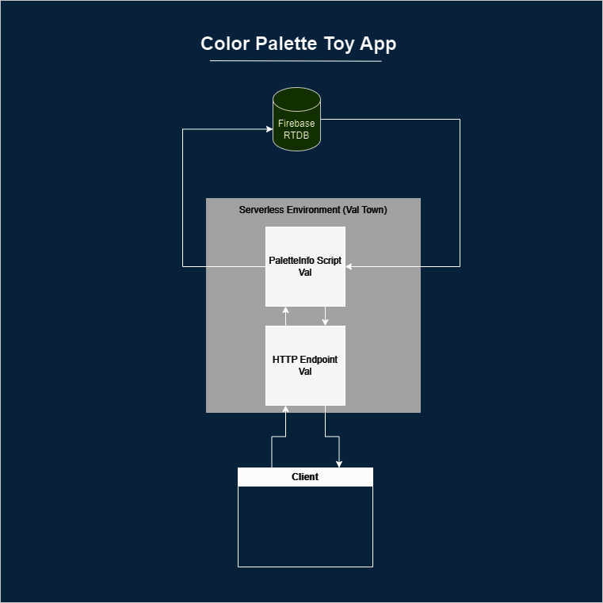
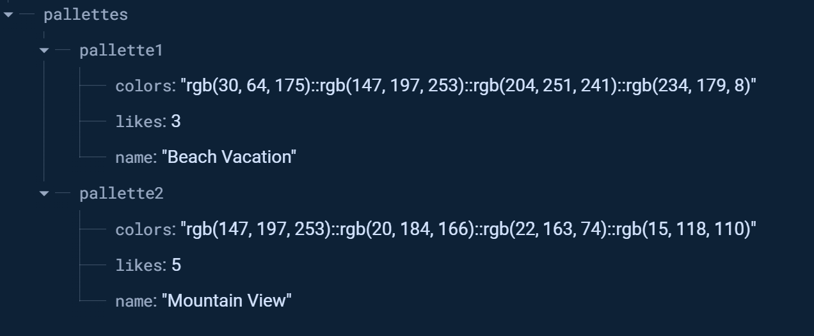
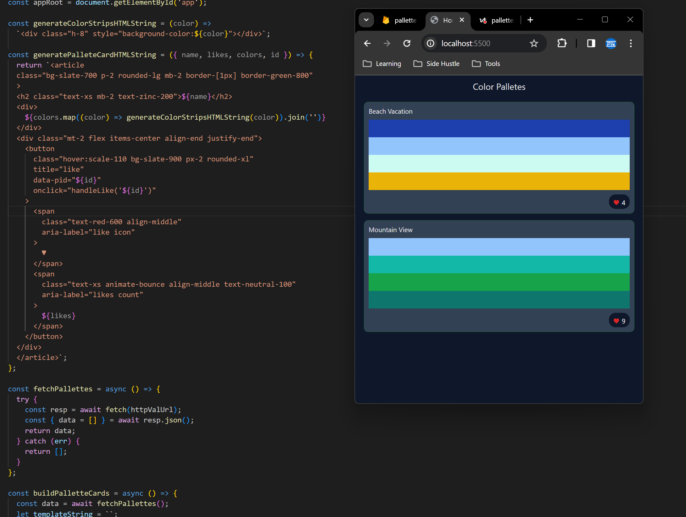

This is a demo toy application built for my [blog article](https://medium.com/@parthipannatkunam/demystifying-serverless-computing-with-val-town-559f37f8d1f3) on serverless computing and Val Town.

### Data Schema

### Screenshot

